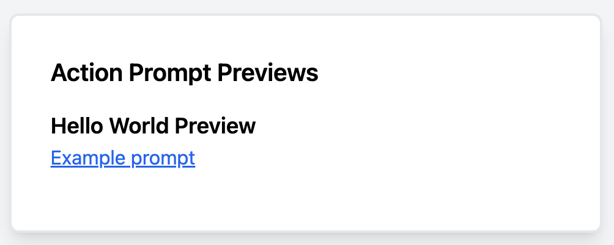

# Action Prompt

[](https://github.com/evdevdev/action_prompt/actions/workflows/ci.yml) [](https://badge.fury.io/rb/action_prompt)

Action Prompt provides a dead simple way to way to organize, preview, and render prompts within a Ruby on Rails App. Because this leverages the `ApplicationController`, you're able to leverage all the bells an whistles

This draws heavy inspiration from `ActionMailer::Preview`.

> [!IMPORTANT]
> This gem is a work-in-progress. **It is not production ready** . That said, `ActionPrompt` is under active development. Any and all feedback would be very welcome. Or hey, feel free to open a PR.

## Motivation & Usage

As LLMs have become ubiquitous in web applications, I've noticed that prompts intended for Claude or GPT have become scattered throughout our codebase or buried within objects. Often, these prompts were built inline through string manipulation. My thinking was two-fold, 1) Let's come up with a simple pattern for organizing and rendering these prompts, and 2) Let's make them easy to review.

## Installation

Install the gem with `gem "action_prompt"`.

## Organizing & Previewing Prompts

1. Create a template for organizing your prompts located at your `app/prompts`. For example, you might create `app/prompts/hello_world.text.erb` and give it the following content:

   ```erb
   You are a helpful assistant who replies with, "<%= @message >"
   ```

2. Create a preview class. These live in `test/prompts` and they inherit from `ActionPrompt::Preview`. For example, you might create `tests/prompts/hello_world_preview.rb` and give it the following context:

   ```ruby
   class HelloWorldPreview < ActionPrompt::Preview
    def example_prompt
      render "hello_world", locals: {message: "Hello, world!"}
    end
   end
   ```

3. Next, start up your rails server (`rails s`) and navigate to [http://localhost:3000/action_prompt/previews](http://localhost:3000/action_prompt/previews). You'll see a list of your prompts that resembles the following:

   

   You can now preview your prompts.

## Rendering prompts within your app

1. Assume you've followed step one above, and you have a prompt located at `app/prompts/hello_world.text.erb`.
2. You can now render this anywhere in your codebase with the following:

   ```ruby
   ActionPrompt::Renderer.new.render("hello_world", locals: {message: "Now we're cooking"})
   # You are a helpful assistant who replies with, "Now we're cooking"
   ```

Under the hood, `ActionPrompt` is leveraging the app's `ApplicationController`. That means you can use the full magic of `ActionView` which includes

- Rendering partials.
- Rendering json with `Jbuilder`
- Using route helpers, i.e. `posts_url`
- ...and more!

## License

The gem is available as open source under the terms of the [MIT License](https://opensource.org/licenses/MIT).
